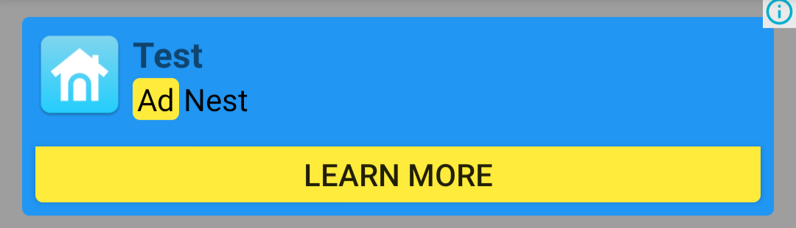
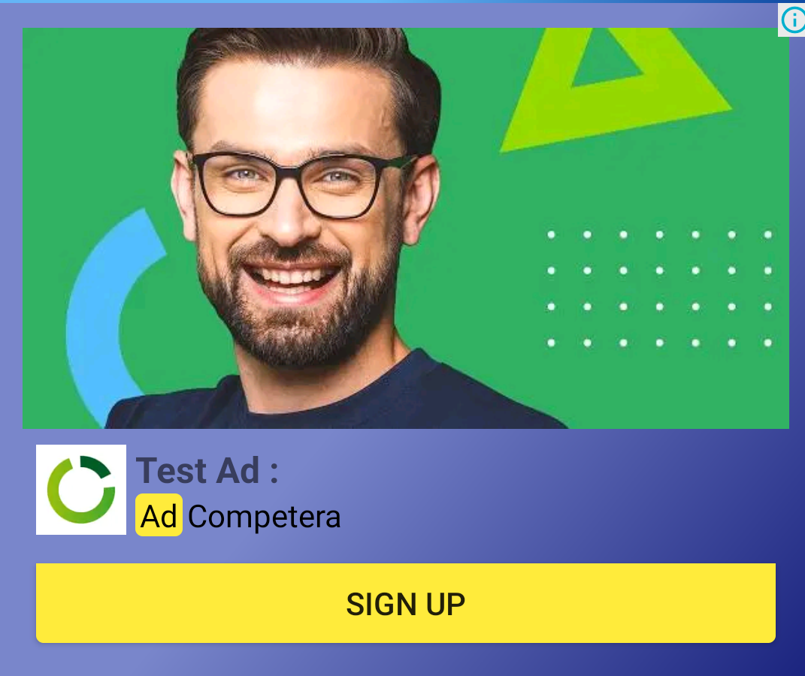
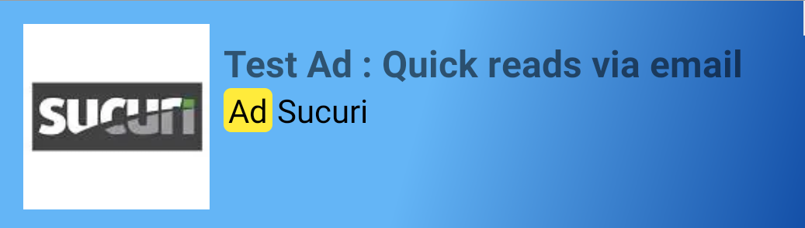

# native_admob_flutter

Anúncios nativos fáceis de fazer em flutter

[English](README.md) | Português

[Leia o guia (Inglês)](https://github.com/bdlukaa/native_admob_flutter/wiki) para uso avançado e mais informações

## ⚠️AVISO⚠️

- Não está pronto para produção. Você pode encontrar alguns problemas
- iOS NÃO é suportado

# Configurações da plataforma

- [x] Android
- [ ] iOS

Google suporta anúncios nativos somente no mobile. Web e desktop estão fora de alcance

## Android

Adicione seu Id de Aplicativo do ADMOB ([Como encontrar?](https://support.google.com/admob/answer/7356431)) no `AndroidManifest.xml`.

```xml
<manifest>
  <application>
    <!-- Id de amostra (testes): ca-app-pub-3940256099942544~3347511713 -->
    <meta-data
      android:name="com.google.android.gms.ads.APPLICATION_ID"
      android:value="ca-app-pub-xxxxxxxxxxxxxxxx~yyyyyyyyyy">
  </application>
</manifest>
```

Mude `minSdkVersion` para `20`. É a versão do sdk mínimo exigido pelo Flutter para usar uma PlatformView. [Saiba mais](https://flutter.dev/docs/development/platform-integration/platform-views#on-the-platform-side)

```groovy
android {
    defaultConfig {
        minSdkVersion 20
    }
}
```

## iOS

iOS não é suportado ainda (Não tenho um ambiente da Apple:/). Se sinta livre para [criar um pull request](https://github.com/bdlukaa/native_admob_flutter/pulls) com a implementação para iOS :)

# Incialize

Antes de criar qualquer anúncio nativo, você deve inicializar o admob. Só pode ser inicializado uma vez:

```dart
import 'package:flutter/foundation.dart';

String get admobUnitId {
  /// Sempre teste com anúncios de teste
  if (kDebugMode)
    return 'ca-app-pub-3940256099942544/2247696110';
  else return 'your-native-ad-unit-id';
}

void main() {
  // Adicione essa linha se você for inicializar antes de runApp
  WidgetsFlutterBinding.ensureInitialized();
  // Unit Id de testes: ca-app-pub-3940256099942544/2247696110
  NativeAds.initialize(admobUnitId);
  runApp(MyApp());
}
```

❗NOTA:❗ Não confunda Unit ID com App ID

## Sempre teste com anúncios de teste

Quando criando e testando seus aplicativos, certifique-se que você está usando anúncios de teste ao invés de anúncios reais, se não sua conta corre o risco de ser suspensa

O jeito mais fácil de carregar anúncios de teste é usar o anúncio de teste para Anúncios nativos no Android:

App ID: `ca-app-pub-3940256099942544~3347511713`\
Unit ID: `ca-app-pub-3940256099942544/2247696110`

Foi especialmente configurado para retornar anúncios de teste para todos os pedidos, e você é livre para usar ele nos seus aplicativos enquanto testa e debuga. Apenas certifique-se que você use seu próprio ID antes de publicá-lo.

Para mais informações sobre como os anúncios de teste funcionam, veja [Anúncios de teste](https://developers.google.com/admob/android/test-ads).

Aprenda a criar seus próprios ids de anúncios nativos [aqui](https://support.google.com/admob/answer/7187428?hl=en&ref_topic=7384666)

## Quando solicitar anúncios

Aplicações mostrando anúncios nativos estão livre para para solicitar eles com antecedência de quando eles realmente serão mostrados. Em muitos casos, esta é a prática recomendada. Um aplicativo mostrando uma lista de items com anúncios nativos no meio, por exemplo, podem carregar anúncios para a lista inteira, mesmo sabendo que alguns serão mostrados apenas depois que o usuário rolar a tela e que alguns podem até não serem exibidos

# Criando um anúncio

Para criar um anúncio, use o widget `NativeAd`:

```dart
NativeAd(
  buildLayout: adBannerLayoutBuilder,
  loading: Text('carregando'),
  error: Text('erro'),
)
```

Nós fornecemos um layout builder padrão: `adBannerLayoutBuilder`:


## Criando um layout builder

Você pod usar cada view apenas uma vez. A google exige que `headline` (cabeçalho) e `attribution` (prerrogativa) estejam no anúncio

```dart
// ⭐Nota⭐: A função precisa ser um getter, senão hot reload não funcionará
AdLayoutBuilder get myCustomLayoutBuilder => (ratingBar, media, icon, headline,
    advertiser, body, price, store, attribution, button) {
  return AdLinearLayout(
    margin: EdgeInsets.all(10),
    borderRadius: AdBorderRadius.all(10),
    // O primerio LinearLayout precisar ser extendido para o tamanho
    // horizontal (width) do pai, senão os filhos não serão bem apresentados
    width: MATCH_PARENT,
    children: [
      AdLinearLayout(
        children: [
          icon,
          AdLinearLayout(
            children: [
              headline,
              AdLinearLayout(
                children: [attribution, advertiser],
                orientation: HORIZONTAL,
                width: WRAP_CONTENT,
              ),
            ],
          ),
        ],
        width: WRAP_CONTENT,
        orientation: HORIZONTAL,
        margin: EdgeInsets.all(6),
      ),
      button,
    ],
    backgroundColor: Colors.blue,
  );
};
```

🔴IMPORTANTE❗🔴: Você NÃO pode usar Widgets do Flutter para construir seu layout

Para usar o layout em seu NativeAd, passe ele como argumento para `layoutBuilder`

```dart
NativeAd(
  layoutBuilder: myCustomLayoutBuilder
)
```

Seu layout deve seguir as Políticas e Diretrizes do Google para Anúncios Nativos. Saiba mais:

- [Políticas e Diretrizes para Anúncios Nativos](https://support.google.com/admob/answer/6329638?hl=en&ref_topic=7384666)
- [Lista de verificação de conformidade com a política de anúncios nativos](https://support.google.com/admob/answer/6240814?hl=en&ref_topic=7384666)

## Customizando views

Todas a views disponíveis são customizáveis. Para customizar uma view use:

```dart
NativeAd(
  layoutBuilder: ...,
  headling: AdTextView(
    style: TextStyle(fontSize: 16, fontWeight: FontWeight.bold, color: Colors.black),
    maxLines: 1,
  ),
  attribution: AdTextView(
    width: WRAP_CONTENT, // Você pode usar WRAP_CONTENT (Retrair)
    height: WRAP_CONTENT, // ou MATCH_PARENT (Expandir)
    padding: EdgeInsets.symmetric(horizontal: 2, vertical: 1),
    backgroundColor: Colors.yellow,
    // O rótulo para indicar que o anúncio é um anúncio.
    // Você pode mudar dependendo no idioma do dispositivo
    text: 'Anúncio',
    margin: EdgeInsets.only(right: 2),
    maxLines: 1,
    borderRadius: AdBorderRadius.all(10),
  ),
  button: AdButtonView(
    backgroundColor: Colors.yellow,
    margin: EdgeInsets.all(6),
    borderRadius: AdBorderRadius.vertical(bottom: 10),
  ),
)
```

### Avaiable views

| Campo        | Classe          | Descrição                                                  | Sempre incluído? | Precisa ser mostrado? |
| ------------ | --------------- | ---------------------------------------------------------- | :--------------: | :-------------------: |
| Cabeçalho    | AdTextView      | Cabeçalho principal (e.x., título do app ou do artigo).    |       Yes        |          Yes          |
| Prerrogativa | AdTextView      | Indica que o anúncio é um anúncio                          |       Yes        |          Yes          |
| Imagem       | AdMediaView     | Imagem larga, principal.                                   |       Yes        |      Recommended      |
| Corpo        | AdTextView      | Corpo (e.x., descrição do app ou do artigo).               |       Yes        |      Recommended      |
| Ícone        | AdImageView     | Imagem pequena (e.x., logo do anúnciante).                 |        No        |      Recommended      |
| Botão        | AdButtonView    | Botão ou texto que encorage o usuário a apertar no anúncio |        No        |      Recommended      |
| Avaliação    | AdRatingBarView | Avaliação de 0 a 5 do aplicativo na loja                   |        No        |      Recommended      |
| Loja         | AdTextView      | A loja de aplicativos onde o usuário vai baixar o app.     |        No        |      Recommended      |
| Preço        | AdTextView      | Preço do aplicativo.                                       |        No        |      Recommended      |
| Anúnciante   | AdTextView      | Identificação do anúnciante (e.x., nome da marca).         |        No        |      Recommended      |

[Saiba mais](https://support.google.com/admob/answer/6240809)

Mais screenshots



O código para elas pode ser encontrado em [example](example/)

## Usando o controller para atender aos eventos

```dart
// Inicie o controller
final controller = NativeAdController();

@override
void initState() {
  super.initState();
  controller.onEvent.listen((e) {
      final event = e.keys.first;
      switch (event) {
        case AdEvent.loading:
          print('carregando');
          break;
        case AdEvent.loaded:
          print('carregado');
          break;
        case AdEvent.loadFailed:
          final errorCode = e.values.first;
          print('carregamento falhou $errorCode');
          break;
        case AdEvent.impression:
          print('anúncio redenrizado');
          break;
        case AdEvent.clicked;
          print('clicado');
          break;
        case AdEvent.muted:
          showDialog(
            ...,
            builder: (_) => AlertDialog(title: Text('Anúncio silenciado')),
          );
          break;
        default:
          break;
      }
  });
}

// Use o controller no NativeAd
@override
Widget build(BuildContext context) {
  return NativeAd(controller: controller);
}

// Deslige o controller
// Uma vez desligado, você não vai poder usá-lo mais
@override
void dispose() {
  controller.dispose();
  super.dispose();
}
```

# A FAZER:

- [Suporte ao iOS](https://developers.google.com/admob/ios/native/start)
- [Anúncios de vídeo nativos](https://developers.google.com/admob/android/native/video-ads)
- [Suporte à elevação](https://developer.android.com/training/material/shadows-clipping)
- Adicionar interção com o anúncio
  - Tooltips
  - Efeito de pressionar o botão